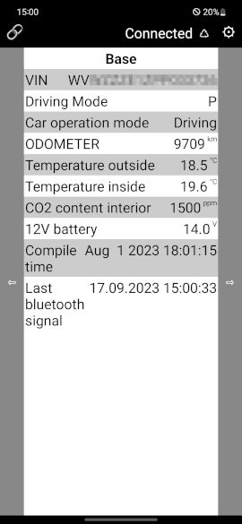
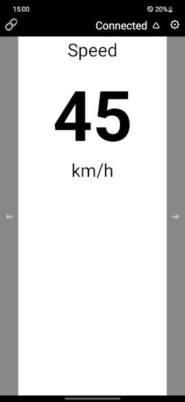
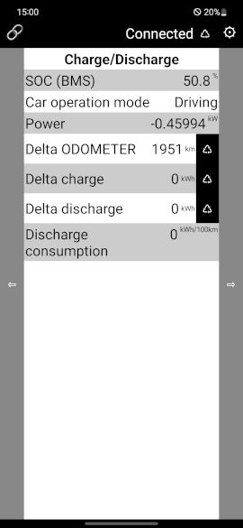

# id3esp32obd2
The id3esp32odb2 is a ESP32 based DIY Bluetooth dongle and an android app to show diagnostics data from a VW ID.3 car on an android device.

The following diagnostics data values are supported:
- SOC (BMS)
- Car operation mode
- ODOMETER
- VIN
- Speed
- Driving mode position
- HV auxiliary consumer power
- HV battery main temperature
- HV battery circulation pump 
- HV battery voltage
- HV battery current
- HV dynamic limit for charging
- HV Total charge
- HV Total discharge
- HV battery capacity
- 12V battery voltage

**WARNING:**
- Connecting something to your VW ID.3 is your own risk and do this ONLY, if you know, what are you doing. If you make a mistake, it could be a very expensive mistake.
- This is no a complete ISO-TP and/or UDS implementation. It is just enough to receive some data from a VW ID.3. I'm no CAN expert, just a beginner
  
## License and copyright
This project is licensed under the terms of the 2-Clause BSD License [Copyright (c) 2023 codingABI](LICENSE). 

## Appendix
### Hardware
- ESP-WROOM-32 NodeMCU (Board manager: ESP32 Dev Model)
- SN65HVD230 CAN transceiver (60 Ohm resistor R2 between CANHigh and CANLow was removed)
- OBD2 Connector cable (Plugged in to the OBD2 female connector below the steering wheel)
- VW ID.3 Car (Code was developed and tested on a ID.3 Pro S)
- Two resistors (470k, 100k) for a voltage divider to measure the 12V car battery voltage on an ESP32 analog pin 
- LM2596 Step down voltage converter (to convert the 12V car battery to 3.3V as a power supply for the ESP32)
- Android device with the self-made app: id3esp32obd2 (https://github.com/codingABI/id3esp32obd2/id3esp32obd2.apk)

Power consumption: 0.6W (0.3W when android device is not connected), 0W when powered off by the toggle switch
### OBD2 and power supply
The VW ID3 has an ODB2 female connector below the steering wheel:

The id3esp32obd2 uses a male OBD2 connector and pin 16 (=12V), pin 5 (=GND) to power up the ESP32 (Converted down to 3.3V by a LM2596). Pin 6 (=CAN High) and 14 (=CAN Low) are used to access the CAN bus. 

The 12V line can be switch on and off with a toggle switch.
### Device description
An ESP32 has builtin support for the CAN bus, but needs an additional CAN transceiver. The ESP32 based id3esp32obd2 uses a SN65HVD230 CAN transceiver. 

The red marked 60 Ohm resistor R2 between CANHigh and CANLow was removed. 

The ESP32 waits for the "correct" android device connecting via Bluetooth (The "correct" android device can be defined in  [secrets.h](/id3esp32obd2/secrets.h)). After connecting with the "correct" android device the ESP32 requests CAN data and forwards the response via Bluetooth. When the android device disconnects the Bluetooth connection the CAN requests will be stopped.

**WARNING**
Do not lock the car without disconnecting the Bluetooth connection or power off the device by the toggle switch, because the VW ID3 may triggers a car alarm, if CAN requests are received in a locked state. 

The id3esp32obd2 waits 500ms between each CAN bus request, because I got weired responses when sending requests too quickly one after the other.

All components are soldered on two pieces perfboard (I had no single perfboard big enough) and the ESP32 is stacked over the SN65HVD230 and the buzzer.

The toggle switch to power on/off the device in mounted on a wooden, black painted clothespeg and can be sticked on a the ventilation grille in the car. The unused pins of the OBD2 cable are protected by heat shrinking tubes.

The id3esp32obd2 is in a wooden self-made case.

The window in the case is to show the builtin leds of the ESP32.
### Code
The code for the ESP32 was written with the Arduino IDE and can be found in the [Arduino-Sketch folder](/id3esp32obd2)

### Schematic

The voltage devider R1/R2 is used to measure the 12V car battery voltage with an ESP32 analog pin.

### Android App
To show the ID3 diagnostics data sent by the device via Bluetooth an android device with the app [id3esp32obd2 app](id3esp32obd2.apk) is needed. This app is a small app made with https://appinventor.mit.edu/ (Source code: [App source code](id3esp32obd2.aia)) for this project and was tested on a Samsung Galaxy S10 5G with Android 12. To install the apk file you have to temporary allow the installation (Samsung: Settings->Apps->Top right dots...->Special access->Install unknown app).

#### Bluetooth pairing and selecting the device
Before you can use the app, you have to pair the android device with the id3esp32obd2 device listed as "id3esp32obd2" in your android Bluetooth management.

After launching the app, you have to connect to the previously paired Bluetooth device by pressing 🔗 to open the list "Bluetooth device" and select "aa:bb... id3esp32obd2" (aa:bb... would be the MAC address of your ESPp32). To manually disconnect an existing connection you can select "Disconnect" in the list "Bluetooth device". 

#### General usage
In the app you can switch between several dashboards with the left ⇦ and right ⇨ buttons. When you move to another dashboard it could take 1.5 seconds to receive first data for the new dashboard and it could take several seconds to receive all dashboard data. When you always receive "ERR" the device could not get the requested data from the CAN bus. In this case you should check the Serial output of the ESP32 for more details.

#### Titlebar

In the title bar you can change the selected the Bluetooth device with 🔗, see the Bluetooth connection status "Connected" or "Disconnected", reset the ESP32 ♺ or open the [info screen](#info-screen) with with ⚙

#### Dashboard Base

The "12V battery" value is measured by the ESP32 directly
#### Dashboard Speed

Shows the current car speed
#### Dashboard HV Battery

#### Dashboard Charge/Discharge

You can reset the delta/differential values with ♺ right to the value
#### Info screen

