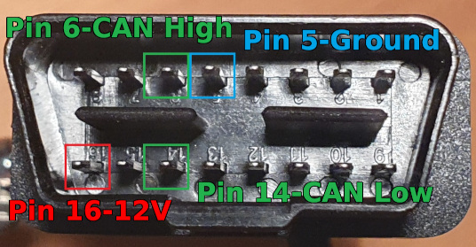
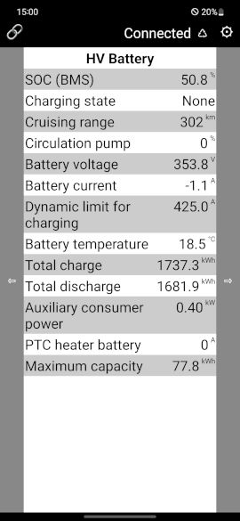

# id3esp32obd2

## License and copyright
This project is licensed under the terms of the 2-Clause BSD License [Copyright (c) 2023 codingABI](LICENSE). 

## Appendix
### OBD2 and power supply
The VW ID3 has an ODB2 female connector below the steering wheel:

The device uses a male OBD2 connector and pin 16 (=12V), pin 5 (=GND) to power up the esp32 (Converted down to 3.3V by a LM2596). Pin 6 (=CAN High) and 14 (=CAN Low) are used to access the CAN bus. 

The 12V line can be switch on and off with a toggle switch.
### Device description
An esp32 has builtin support for the CAN bus, but needs an additional CAN tranceiver. This device uses a SN65HVD230 CAN transceiver (The 60 Ohm resistor R2 between CANHigh and CANLow was removed). The esp32 waits for the "right" mobile phone connecting via bluetooth (The "right" mobile phone can be defined in  [secrets.h](/id3esp32obd2/secrets.h)). After connecting with the "right" mobile phone the esp32 requests CAN data and forwards the response via bluetooth. When the mobile phone disconnects the bluetooth connection the CAN requests will be stopped.

**WARNING**
Do not lock the car without disconnecting the bluetooth connection or power off the device by the toggle switch, because the VW ID3 may triggers a car alarm, if CAN requests are received in a locked state. 
 

[Arduino-Sketch](/id3esp32obd2/id3esp32obd2.ino)

The toggle switch to power on/off the device in mounted on a wooden, black painted clothespeg and can be sticked on a the ventilation grille in the car. The unused pins of the OBD2 cable are protected by heat shrinking tubes.

Wooden self-made case.

The window in the case is to show the builtin leds of the esp32.

### Android App
To show the ID3 diagnostics data sent by the device via bluetooth an Android phone with the app [id3esp32obd2 app](id3esp32obd2.apk) is needed. This app is a small app made with https://appinventor.mit.edu/ (Source code  [App source code](id3esp32obd2.aia)) and was tested on a Samsung Galaxy S10 5G with Android 12. To install the apk file you have to temporary allow the installation (Samsung: Settings->Apps->Top right dots...->Special access->Install unknown app).

#### Bluetooth pairing and selecting the device
Before you can use the app, you have to pair the phone with the device listed as "id3esp32obd2" in your android bluetooth management.

After launching the app, you have to connect to the previously paired bluetooth device by pressing 🔗 to open the list "Bluetooth device" and select "xx:xx... id3esp32obd2" (xx:xx... would be the MAC address of your esp32). To manually disconnect an existing connection you can select "Disconnect" in the list "Bluetooth device". 

#### General usage
In the app you can switch between several dashboards with the left ⇦ and right ⇨ buttons. When you move to another dashboard it could take 1.5 seconds to receive first data for the new dashboard and it could take several seconds to receive all dashboard data. When you always receive "ERR" the device could not get the requested data from the CAN bus. In this case you should check the Serial output of the esp32 for more details.

#### Titlebar

In the title bar you can change the select the bluetooth device with 🔗, see the bluetooth connection status "Connected" or "Disconnected", reset the esp32 ♺ or open an info screenwith with ⚙

#### Dashboard Base

The "12V battery" value is measured by the device directly
#### Dashboard Speed

Shows the current car speed
#### Dashboard HV Battery

#### Dashboard Charge/Discharge

You can reset the delta/differential values with ♺ right to the value
#### Info screen

