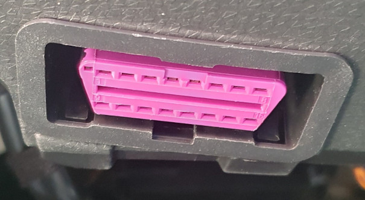

# id3esp32obd2

## License and copyright
This project is licensed under the terms of the 2-Clause BSD License [Copyright (c) 2023 codingABI](LICENSE). 

## Appendix
### OBD2 and power up
The VW ID3 has an ODB2 connector below the steering wheel.

The id3esp32obd2 uses pin 16 (=12V) and pin 5 (=GND) to power up the device and pin 6 (=CAN High) and 14 (=CAN Low) to access the CAN bus. 

The 12V line can be switch on and off with a toggle switch.

[Arduino-Sketch](/id3esp32obd2/id3esp32obd2.ino)

